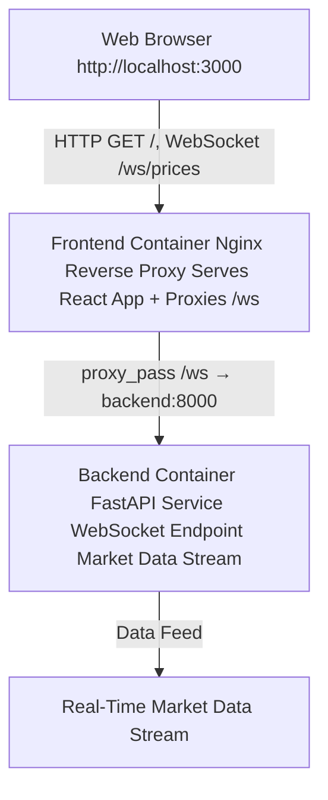

# Real-Time Finance Streaming Platform

This project demonstrates a **production-grade real-time data streaming platform** using:

- Python FastAPI backend
- React frontend dashboard
- WebSockets for live streaming
- Docker + Docker Compose for local orchestration

This project demonstrates:
- System design thinking
- Platform engineering mindset
- Distributed systems basics
- Real-time data streaming
- Cloud-native architecture patterns
- Production-grade deployment approach

---

## Architecture Overview





---

## Prerequisites (Windows)

### 1. Install Docker Desktop
Download and install:
https://www.docker.com/products/docker-desktop/

During installation:
- Enable **WSL2 backend**
- Restart your machine

Verify installation:

```bash
docker --version
docker compose version


cd infra
docker compose up

Step 2 — Open Applications

Frontend Dashboard
http://localhost:3000

Backend API
http://localhost:8000