# Real-Time Finance Streaming Platform

A containerized real-time financial data streaming platform built with:

- **FastAPI (Python)** backend for WebSocket data streaming
- **React** frontend for live visualization
- **Docker + Docker Compose** for service orchestration
- **Nginx reverse proxy** as a single public entrypoint

This project demonstrates a production-style container architecture for a real-time streaming system.

---

## Overview

The platform simulates live market data and streams it to a browser-based dashboard using WebSockets.

The focus of this project is system architecture and deployment patterns rather than financial modeling.

Key aspects include:

- Multi-stage Docker builds
- Separation of build and runtime environments
- Reverse proxy routing for internal services
- Container networking via Docker bridge network
- Minimal Alpine-based container images

---

## Architecture

```mermaid
flowchart TD
    Browser[Web Browser http://localhost:3000]
    Nginx[Frontend Container Nginx Reverse Proxy Serves SPA + Proxies /ws]
    Backend[Backend Container FastAPI Service WebSocket Endpoint]
    Market[Simulated Market Data Generator]

    Browser -->|HTTP + WebSocket| Nginx
    Nginx -->|proxy_pass /ws → backend:8000| Backend
    Backend -->|Streams Data| Market
```



## Architectural Notes
- The browser communicates only with the frontend container.
- Nginx serves static assets and proxies WebSocket traffic to the backend.
- The backend is isolated within the Docker network.
- Services communicate via Docker DNS (backend:8000).
- Build and runtime environments are separated using multi-stage Docker builds.

## Running Locally
### Prerequisites

Docker Desktop (WSL2 on Windows recommended)

### Start the Platform
```bash
docker compose up --build
```

Once started, access:
- Frontend: http://localhost:3000
- Backend (internal API): http://localhost:8000

## Project Structure
```
backend/      FastAPI service
frontend/     React application
infra/        Docker Compose configuration
docs/adr/     Architectural Decision Records
```

## Architectural Decisions

Architectural Decision Records (ADRs) are available in [docs/adr/](docs/adr).

They document decisions such as:
- Use of Alpine-based images
- Multi-stage frontend build pattern
- Reverse proxy routing strategy
- Container isolation design

## Possible Extensions

This project can be extended with:
- Persistent storage (e.g., PostgreSQL)
- Event streaming (e.g., Redis or Kafka)
- Metrics and observability integration
- Load testing and benchmarking
- CI workflows for automated testing

## License
MIT